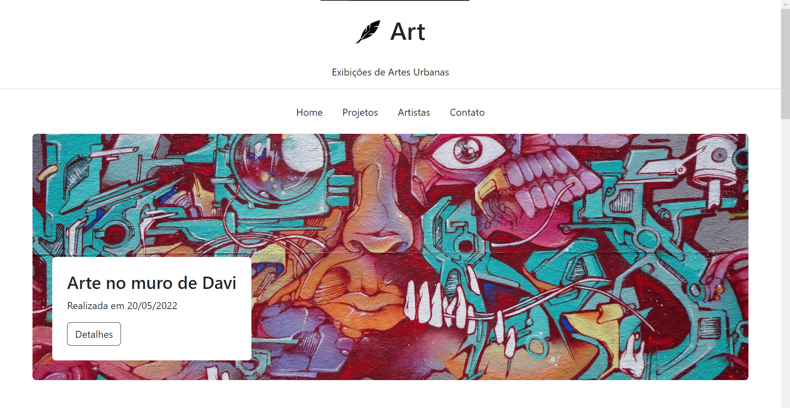
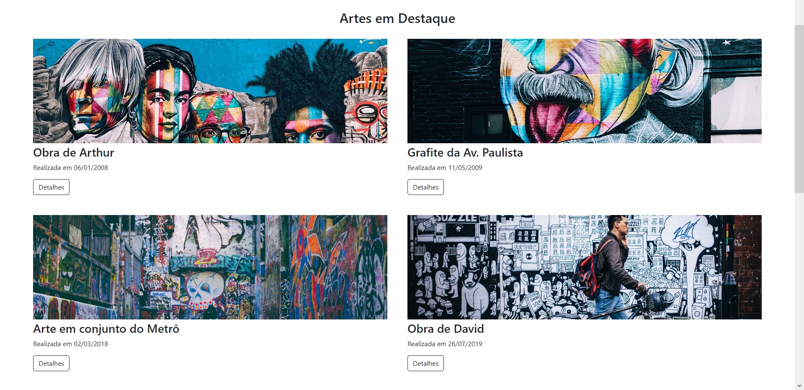
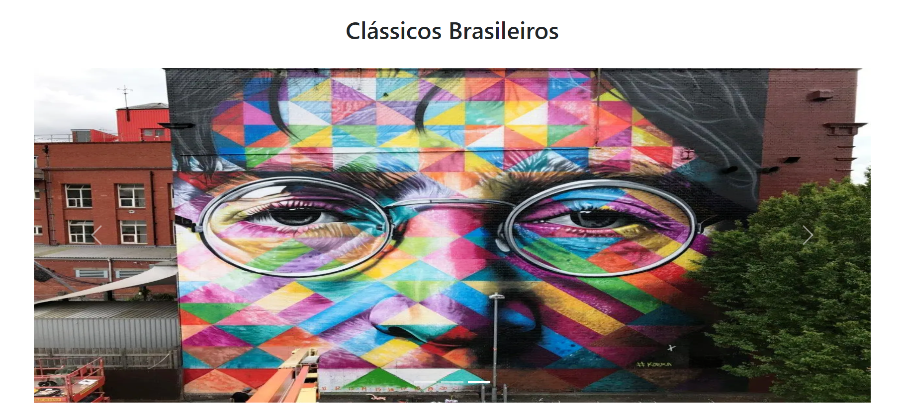

## 👨‍🏫Projeto

**Tudo sobre o Art** é um site com objetivo de ilustrar artes importantes no Brasil e testar meus conhecimentos em programação Web;

**Header**
<br />
<br />

<br />
<br />

**Main**
<br />
<br />

<br />
<br />

**Slider**
<br />
<br />

<br />
<br />

## 👨🏻‍💻Tecnologias usadas

Este projeto foi desenvolvido utilizando as seguintes tecnologias:

- HTML5
- CSS3
- JavaScript

## ▶️Como rodar

### **Passo a passo para rodar a aplicação**

1. Faça o clone do repositório :

```sh
  $ git clone https://github.com/pedrinw/Art.git
```

2. Executando a Aplicação:

```sh
  $ run with live server
```

<h4 align="center">
    👨🏻‍🚀 Feito por Pedro Henrique
</h4>
